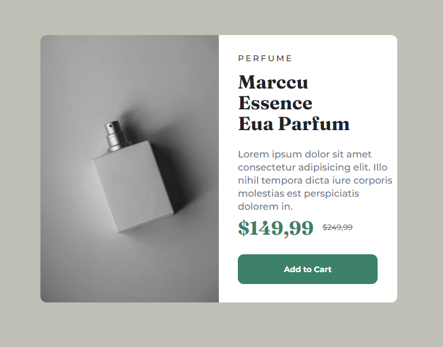

<h1 align="center">Cartão de Produto 📦</h1>

Este é um desafio de componente de cartão de visualização para produtos do Frontend Mentor. Os desafios deste site ajudam a melhorar as habilidades de codificação criando projetos realistas.

 
 <h2>🕹️ Tecnologias Utilizadas</h2>
    <ul align="center">
        
        
    </ul> 

<h2 align="center">🤔 Como Utilizar</h2>
 
A página apresenta as informações de um produto, com nome, categoria, descrição e preço. Abaixo temos uma imagem do sistema:
 

<i>Gif - funcionalidades do sistema</i>

<h2 align="center">🔗 Link da página</h2>

Logo abaixo temos o link da página para visualização e testes:

👉 <a href="#" target="_blank">Cartão de Produto</a>  

<!-- <h2 align="center">🏆 Status Projeto</h2>

 

 -->